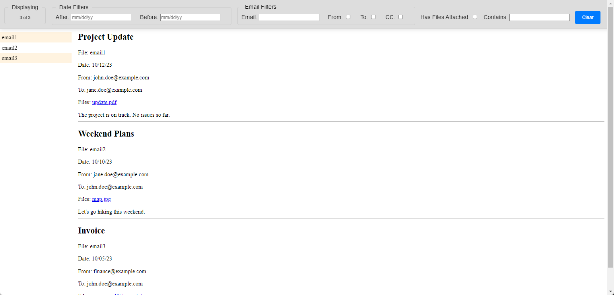

# Message Reviewer

## Introduction

The Message Reviewer tool is designed to simplify the task of reviewing a folder full of `.msg` files, such as those that might be presented as evidence in legal cases. This is not a forensics tool but it may be useful to help rapidly review information. The tool reads all `.msg` files in the specified folder and generates an HTML interface that allows for easy viewing and filtering of the emails based on several criteria.

## Features

- **Search**: Quickly find specific emails based on keyword search.
- **Date Range**: Filter emails within a specific date range.
- **Sender and Receiver**: Easily filter emails based on the sender and receiver email addresses.
- **Attachments**: Filter emails that have attachments.

## Installation and Setup

1. **Install Python**: Make sure you have Python 3.10 installed on your computer. If not, download and install it from [here](https://www.python.org/downloads/).
2. **Install Pipenv**: Open a terminal and run `pip install pipenv` to install the Pipenv package manager.
3. **Clone the Repository**: Clone this repository to your local machine.
4. **Install Dependencies**: Navigate to the project folder and run `pipenv install` to install all the required dependencies.
5. **Activate the Virtual Environment**: Run `pipenv shell` to activate the virtual environment.

## Usage

1. **Run the Tool**: In the virtual environment, run the command `python generate_messages_json.py --path <path_to_msg_files>`. This will generate a `revmsg` folder containing `index.html` and extracted messages in the specified folder.
2. **Open HTML**: Double-click the generated `index.html` file to open it in a web browser.
3. **Review and Filter Emails**: Use the HTML interface to review and filter emails as needed.
4. **Exit the Tool**: Close the web browser to exit the tool. Type `exit` in the terminal to exit the virtual environment.

## Feedback, Features, Contributions

I don't expect contributions but welcome them in the form of pull requests. Use the Issues in this repo if you find something not working as expected or have a specific feature request, and Discussions if you just want to hash out an idea but don't have specifics.
